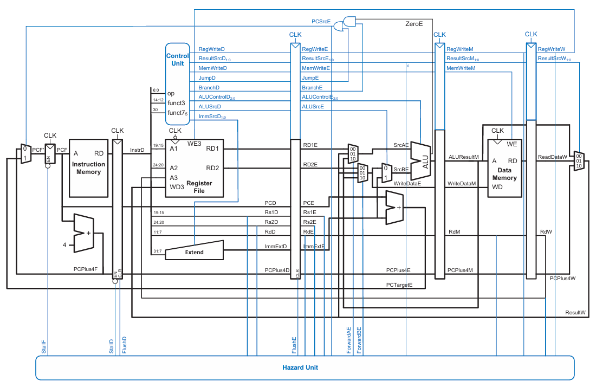

# RV32I 5-Stage Pipelined Processor

Copyright 2026 Pham Bao Thanh — Licensed under the [Apache License, Version 2.0](LICENSE)

A synthesizable, fully-verified implementation of a RISC-V RV32I 5-stage in-order pipeline in Verilog.
Built for the Computer Architecture course at HUST (Hanoi University of Science and Technology).

---

## Pipeline Block Diagram



---

## Features

- **5-stage pipeline**: IF → ID → EX → MEM → WB
- **Full data forwarding**: EX/MEM→EX and MEM/WB→EX paths eliminate most RAW stalls
- **Load-use hazard detection**: 1-cycle stall inserted automatically
- **Control hazard handling**: 2-cycle pipeline flush on taken branches and JAL/JALR
- **Write-through register file**: same-cycle WB→ID bypass prevents WB-stage RAW hazard
- **Active-low synchronous reset** (`rstn`)
- **RV32I instruction subset** (see table below)

---

## Supported Instructions

| Type   | Instructions |
|--------|-------------|
| R-type | `add`, `sub`, `and`, `or`, `xor`, `sll`, `srl`, `sra`, `slt`, `sltu` |
| I-type | `addi`, `andi`, `ori`, `xori`, `slli`, `srli`, `srai`, `slti`, `sltiu` |
| Load   | `lw` |
| Store  | `sw` |
| Branch | `beq`, `bne`, `blt`, `bge`, `bltu`, `bgeu` |
| Jump   | `jal`, `jalr` |
| Upper  | `lui`, `auipc` |

---

## Directory Structure

```
PROJECT/
├── Makefile                  # Build & simulation entry point
├── .gitignore
├── README.md
│
├── src/                      # RTL source files
│   ├── riscv_top.v           # Top-level integration
│   ├── if_stage.v            # Instruction Fetch stage
│   ├── id_stage.v            # Instruction Decode / Register Read stage
│   ├── ex_stage.v            # Execute stage (ALU + branch target)
│   ├── mem_stage.v           # Memory Access stage
│   ├── wb_stage.v            # Write-Back stage
│   ├── pipeline_regs.v       # IF/ID, ID/EX, EX/MEM, MEM/WB registers
│   ├── hazard_unit.v         # Forwarding, stall, and flush control
│   ├── control_unit.v        # Main decoder + ALU decoder
│   ├── main_decoder.v        # Opcode → control signals
│   ├── alu_decoder.v         # funct3/funct7 → ALU operation
│   ├── alu.v                 # 32-bit ALU
│   ├── register_file.v       # 32×32 register file, write-through bypass, x0 hardwired 0
│   ├── imm_extend.v          # Immediate sign-extension (all RV32I types)
│   ├── instruction_memory.v  # ROM (initialised from sim/memfile.hex)
│   ├── data_memory.v         # Single-port RAM
│   ├── pc.v                  # Program counter register
│   ├── adder.v               # 32-bit adder (PC+4, branch target)
│   └── mux.v                 # 2-to-1 and 3-to-1 multiplexers
│
├── sim/                      # Simulation files
│   ├── memfile.hex           # Basic test program (memfile.hex)
│   ├── memfile2.hex          # Comprehensive test program (all instr + explicit hazards)
│   ├── tb_riscv_top.v        # Integration testbench for memfile.hex
│   ├── tb_riscv_top2.v       # Integration testbench for memfile2.hex
│   ├── tb_if_stage.v
│   ├── tb_id_stage.v
│   ├── tb_ex_stage.v
│   ├── tb_mem_stage.v
│   ├── tb_pipeline_regs.v
│   ├── tb_hazard_unit.v
│   ├── tb_register_file.v
│   ├── tb_instruction_memory.v
│   ├── tb_data_memory.v
│   ├── tb_control_unit.v
│   ├── tb_alu.v
│   ├── tb_imm_extend.v
│   ├── tb_alu_decoder.v
│   ├── tb_main_decoder.v
│   ├── tb_wb_stage.v
│   ├── tb_pc.v
│   ├── tb_adder.v
│   └── tb_mux.v
│
├── docs/                     # Design specifications
│   └── spec.md               # Control unit decode tables, instruction fields, ALU encoding
│
├── images/                   # Block diagrams
│   ├── riscv_pipeline.png
│   └── riscv_single.png
│
├── build/                    # Compiled simulation binaries (auto-generated, gitignored)
└── waves/                    # VCD waveform files (auto-generated, gitignored)
```

---

## Prerequisites

### Icarus Verilog

The simulation flow requires **Icarus Verilog** (`iverilog` + `vvp`) on your `PATH`.

| OS | Installation |
|----|-------------|
| **Windows** | Download the installer from [bleyer.org/icarus](https://bleyer.org/icarus/). During setup, check *"Add to PATH"*. |
| **Ubuntu / Debian** | `sudo apt install iverilog` |
| **Fedora / RHEL** | `sudo dnf install iverilog` |
| **macOS (Homebrew)** | `brew install icarus-verilog` |

Verify the install:
```bash
iverilog -V
vvp -V
```

### GTKWave (waveform viewer, optional)

| OS | Installation |
|----|-------------|
| **Windows** | Bundled with the Icarus Verilog installer above. |
| **Ubuntu / Debian** | `sudo apt install gtkwave` |
| **macOS (Homebrew)** | `brew install --cask gtkwave` |

---

## Running Simulations

All `make` commands must be run from the **project root** directory (where `Makefile` lives).

### Run a single module testbench

```bash
make <target>
```

Available targets:

```
adder  mux  pc  wb_stage
alu  imm_extend  alu_decoder  main_decoder  control_unit
register_file  instruction_memory  data_memory
hazard_unit  pipeline_regs
if_stage  id_stage  ex_stage  mem_stage
riscv_top  riscv_top2
```

Examples:
```bash
make alu           # test the ALU
make hazard_unit   # test forwarding and hazard detection
make riscv_top     # end-to-end test with memfile.hex
make riscv_top2    # end-to-end test with memfile2.hex (all instructions + explicit hazards)
```

### Run all testbenches in order

```bash
make all
```

### Clean generated outputs

```bash
make clean        # removes build/ and waves/
```

### Output files

| File | Location | Description |
|------|----------|-------------|
| `<name>.out` | `build/` | Compiled simulation binary |
| `<name>.vcd` | `waves/` | VCD waveform dump |

---

## Viewing Waveforms

After running a simulation, open the corresponding VCD file in GTKWave:

```bash
gtkwave waves/tb_riscv_top.vcd &
```

In GTKWave:
1. Expand the module hierarchy in the left panel
2. Drag signals into the wave view
3. Use **Format → Binary / Hex / Decimal** to change signal radix

---

## Hazard Unit

The hazard unit (`src/hazard_unit.v`) resolves all three classes of pipeline hazard.

### Data Forwarding

Forwarding eliminates RAW stalls for instructions that can get their operand from a later pipeline stage without waiting for register writeback.

| Path | Condition | Signal |
|------|-----------|--------|
| EX/MEM → EX | `RegWriteM && RdM != 0 && RdM == Rs1E` | `ForwardAE = 2'b10` |
| EX/MEM → EX | `RegWriteM && RdM != 0 && RdM == Rs2E` | `ForwardBE = 2'b10` |
| MEM/WB → EX | `RegWriteW && RdW != 0 && RdW == Rs1E` | `ForwardAE = 2'b01` |
| MEM/WB → EX | `RegWriteW && RdW != 0 && RdW == Rs2E` | `ForwardBE = 2'b01` |

EX/MEM takes priority over MEM/WB when both match the same register. `x0` is never forwarded.

### Load-Use Stall

A load instruction cannot forward its result to the immediately following instruction because the data is not available until the end of the MEM stage.

**Detection:** `ResultSrcE == 2'b01` (instruction in EX is a load) **and** `RdE != 0` **and** `RdE == Rs1D` or `RdE == Rs2D`

**Action (1 cycle):**

| Signal | Value | Effect |
|--------|-------|--------|
| `StallF` | 1 | Hold PC (do not advance) |
| `StallD` | 1 | Hold IF/ID register |
| `FlushE` | 1 | Insert NOP bubble into ID/EX register |

After the stall cycle, the load result is in MEM/WB and forwarded normally.

### Control Hazard Flush

When a branch is taken or a jump executes, two instructions already in the pipeline (at IF and ID) are on the wrong path and must be discarded.

**Detection:** `PCSrcE == 1`

**Action (2 cycles):**

| Signal | Value | Effect |
|--------|-------|--------|
| `FlushD` | 1 | Clear IF/ID register → squash instruction in ID |
| `FlushE` | 1 | Clear ID/EX register → squash instruction in EX |

---

## Pipeline Registers

| Register | Key signals carried |
|----------|---------------------|
| **IF/ID** | `InstrD`, `PCD`, `PCPlus4D` — stall with `en=0`, flush with `clr=1` (→ NOP `0x00000013`) |
| **ID/EX** | All control signals (`RegWriteE`, `MemWriteE`, `ALUSrcE`, `JumpE`, `BranchE`, `ASelE`, `ResultSrcE`, `ALUControlE`, `Funct3E`), data (`RD1E`, `RD2E`, `ImmExtE`, `PCE`, `PCPlus4E`), addresses (`Rs1E`, `Rs2E`, `RdE`) — flush with `clr=1` (→ all zeros / NOP bubble) |
| **EX/MEM** | `RegWriteM`, `MemWriteM`, `ResultSrcM`, `ALUResultM`, `WriteDataM`, `PCPlus4M`, `RdM` |
| **MEM/WB** | `RegWriteW`, `ResultSrcW`, `ALUResultW`, `ReadDataW`, `PCPlus4W`, `RdW` |

---

## Module Hierarchy

```
riscv_top
├── if_stage
│   ├── pc              (program counter)
│   ├── adder           (PC + 4)
│   ├── mux             (PCNext: PC+4 or PCTargetE)
│   └── instruction_memory
├── pipeline_IF_ID
├── id_stage
│   ├── register_file
│   ├── control_unit
│   │   ├── main_decoder
│   │   └── alu_decoder
│   └── imm_extend
├── pipeline_ID_EX
├── ex_stage
│   ├── mux_3_1         (ForwardA: RD1E / ResultW / ALUResultM)
│   ├── mux_3_1         (ForwardB: RD2E / ResultW / ALUResultM)
│   ├── mux             (ALUSrc: WriteDataE or ImmExtE)
│   ├── alu
│   └── adder           (branch target = PCE + ImmExtE)
├── pipeline_EX_MEM
├── mem_stage
│   └── data_memory
├── pipeline_MEM_WB
├── wb_stage
│   └── mux_3_1         (ResultW: ALUResultW / ReadDataW / PCPlus4W)
└── hazard_unit
```

---

## Test Programs

### `sim/memfile.hex` — Basic integration test

| Address | Instruction | Result |
|---------|------------|--------|
| `0x00` | `addi x1, x0, 5` | x1 = 5 |
| `0x04` | `addi x2, x0, 3` | x2 = 3 |
| `0x08` | `add  x3, x1, x2` | x3 = 8 |
| `0x0C` | `sub  x4, x1, x2` | x4 = 2 |
| `0x10` | `and  x5, x1, x2` | x5 = 1 |
| `0x14` | `or   x6, x1, x2` | x6 = 7 |
| `0x18` | `xor  x7, x1, x2` | x7 = 6 |
| `0x1C` | `sw   x3, 0(x0)` | DMEM[0] = 8 |
| `0x20` | `lw   x8, 0(x0)` | x8 = 8 — **load-use stall** |
| `0x24` | `beq  x8, x3, +8` | taken → PC = 0x2C — **2-cycle flush** |
| `0x28` | `addi x9, x0, 99` | SKIPPED (squashed) |
| `0x2C` | `addi x10, x0, 1` | x10 = 1 |
| `0x30` | `jal  x11, +8` | x11 = 0x34, PC = 0x38 — **2-cycle flush** |
| `0x34` | `addi x12, x0, 200` | SKIPPED (squashed) |
| `0x38` | `addi x13, x0, 42` | x13 = 42 |
| `0x3C` | `jal  x0, 0` | halt |

### `sim/memfile2.hex` — Comprehensive test (all instructions + explicit hazards)

Covers all RV32I instruction types (R, I, U, Load, Store, Branch, JAL, JALR) plus a dedicated hazard test section:

| Address | Instruction | Hazard exercised |
|---------|------------|-----------------|
| `0xCC` | `addi x31, x0, 10` | — (producer) |
| `0xD0` | `add  x31, x31, x31` | **EX/MEM→EX forwarding** (`ForwardAE = ForwardBE = 2'b10`) → x31 = 20 |
| `0xD4` | `addi x31, x0, 5` | — (producer) |
| `0xD8` | `nop` | — (gap) |
| `0xDC` | `add  x31, x31, x31` | **MEM/WB→EX forwarding** (`ForwardAE = ForwardBE = 2'b01`) → x31 = 10 |
| `0xE0` | `sw   x31, 0(x0)` | — (setup) |
| `0xE4` | `lw   x31, 0(x0)` | — (load; triggers stall) |
| `0xE8` | `add  x31, x31, x31` | **Load-use stall** (1-cycle) + MEM/WB fwd → x31 = 20 |
| `0xEC` | `jal  x0, 0` | halt |

---

## Test Coverage

| Group | Targets | Tests |
|-------|---------|-------|
| Primitives | `adder`, `mux`, `pc`, `wb_stage` | Arithmetic, select, reset, write-back mux |
| ALU & Decode | `alu`, `imm_extend`, `alu_decoder`, `main_decoder`, `control_unit` | All operations, all immediate types, all opcodes |
| Memory & Registers | `register_file`, `instruction_memory`, `data_memory` | Read/write, x0 hardwired, reset |
| Hazard | `hazard_unit` | All forwarding paths, load-use stall, branch flush |
| Pipeline regs | `pipeline_regs` | Stall, flush, normal propagation for all 4 registers |
| Stages | `if_stage`, `id_stage`, `ex_stage`, `mem_stage` | Per-stage functional verification |
| Integration (basic) | `riscv_top` | End-to-end execution, halt loop, mid-run reset |
| Integration (full) | `riscv_top2` | All RV32I instructions, explicit EX/MEM→EX and MEM/WB→EX forwarding, load-use stall, all branch types, JAL, JALR |
